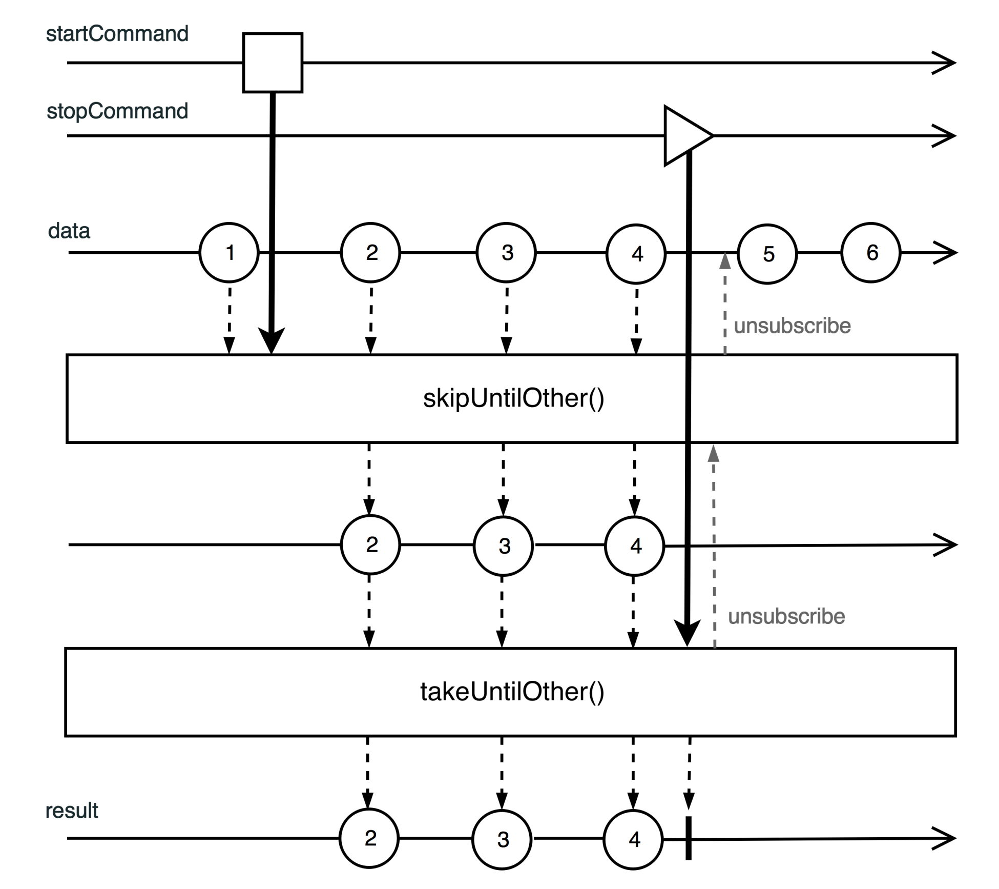

Flux和Mono
响应式规范中Publisher<T>的实现类

Flux可以产生0..N个元素（无限流）

Mono最多生成一个元素（可以轻松的替换CompletableFuture<T>）

Mono对比Flux 跳过了冗余缓冲区和昂贵的同步。

```java
Mono.from(Flux.from(mono))
```
上述代码实际返回原始mono，并不会执行转换。

Rxjava2与ProjectReactor

1. Observable：  Rxjava2对比Rxjava1不再接受null。Observable既不实现背压，也不实现Publisher（响应式规范），不推荐作用与大量元素，但其开销小于Flowable、具有toFlowable方法，转换需要选择背压策略。

2. Flowable：  直接对应Flux，实现了Publisher。

3. Single：  生成且仅生成一个元素的流，不继承Publisher，使用toFlowable不要背压策略。对比mono更接近CompletableFuture，但是依然是不订阅不执行。

4. Maybe：  与Mono类型具有相同的语义，但是不实现Publisher，需要时使用toFlowable

5. Completable： 只能触发onError或onComplete，不能产生onNext，没有实现Publisher接口，toFlowable方法不能生成带onNext的Mono<void>类型。

defer工厂方法：
会创建一个序列，并在订阅时决定其行为。
```java
Mono<User> requestUserData(String sessionId) {
    return Mono.defer( ()->
        isValidSession(sessionId)         
        ? Mono.fromCallable( () -> requestUser(sessionId) )
        : Mono.error(new RuntimeException("Invalid user session")));
        }
```
去掉Mono.defer，会将判断执行在订阅之前。

### 过滤响应式序列：
先开始一个流，停止它来自另一个流的事件响应，代码：
```java
Mono<?> startCommand = ...
Mono<?> stopCommand = ...
Flux<UserEvent> streamOfData = ...

streamofData
    .skipUntilOther(startCommand)
    .takeUnitOther(stopCommand)
    .subscribe(System.out::Print)
```
弹珠图：


### 映射响应式序列：

map(Function<T,R>) 操作符之后Flux<T>变成Flux<R>底层实现是cast(Class c)强制转换方法。

### 收集响应式序列：

collectList会将Flux处理为Mono<list> 收集操作很耗内存 如果对无限流收集或消耗所有内存。

collectMap 映射为Map<k,T>

collectMultimap  ->  Map<K,Collection<T>>

repeat() 循环操作

defaultIfEmpty(T)  为Flux和Mono提供默认值

distinct() 仅传递未在流中遇到的元素。高基数会耗尽内存。可以重载

Flux.distinctUntilChanged() 可以适用无限流去重（仅去重和前一个相同的元素）

### 裁剪响应式序列：

Flux.any(Predicate) 操作符检查是否至少有一个元素具有所需的属性。

hasElements 操作符检查流中是否包含多个元素（短路逻辑）

any 操作符不仅可以检查元素的相等性，还可以通过Predicate实例来检查其他属性

sort 操作符可以在后台对元素排序，在完成后发出已排序的序列

reduce 自定义裁剪

scan能把中间结果发送到下游

then、thenMany、thenEmpty，在上游完成时完成，这些操作符忽略传入元素，仅重放完成或错误信号，触发新流

### 合并响应式序列：

concat 通过向下游转发接收的元素来链接数据源，先消费发送第一个再消费发送第二个

merge 将上游的序列数据合并到一个下游序列，与Concat不同，merge是同时的

zip操作符 将上游所有源的一个元素，组合到一个输出元素中 （取最下元素）

combineLatest 与zip类似 只要有一个元素发送就合并，另一个前一个值

### 批处理响应式序列：

buffer 缓冲到容器，结果流的类型为Flux<List<T>>。不是每次都需要小请求时，可以buffer合并处理，缓冲提高效率

windowing 开窗 将元素加入Flux<Flux<T>> 流的元素变成另一个流

group 分组到Flux<GroupedFlux<K,T>>类型的流，一个key对应一个流实例

### flatmap系列操作符：

flatmap可以理解为map+merge两个组合，先转换再返回一个新的流。
不同的变体有： FlatMapSequential 和 concatMap

flatmap和FlatMapSequential会立即订阅，concatMap会等待全部完成再执行子流订阅。

concatMap保留源元素相同的顺序，FlatMapSequential会排序，flatmap不一定

flatmap允许子流元素交错，FlatMapSequential和concatMap不允许。

### 采样操作符

sample: 不要所有传入事件就能成功操作的场景

### 阻塞操作

toIterable 将Flux转为阻塞Iterable

toStream Flux转为阻塞Stream（Reactor3.2+ 底层调了toIterable）

blockFirst 阻塞当前线程，直到上游发出第一个值或完成流为止

blockLast 阻塞当前线程，直到上游发出最后一个值或完成流为止，如果onError照常抛出。

toIterable，toStream能够用Queue储存先于阻塞完成的事件。

### doOn(信号流)操作符

doOnNext  对Flux或Mono每一个元素执行一些操作。

doOnComplete和doOnError 可以处理相应事件。

doOnSubscribe,doOnRequest,doOnCancel，对对应生命周期事件作出响应。

doOnTerminate(Runnable) 终止时，无论如何都会被调用

doOnEach 处理onError,onSubscribe,onNext,onComplete。

materialize 和 dematerialize 提供信号流与数据流的转换。

