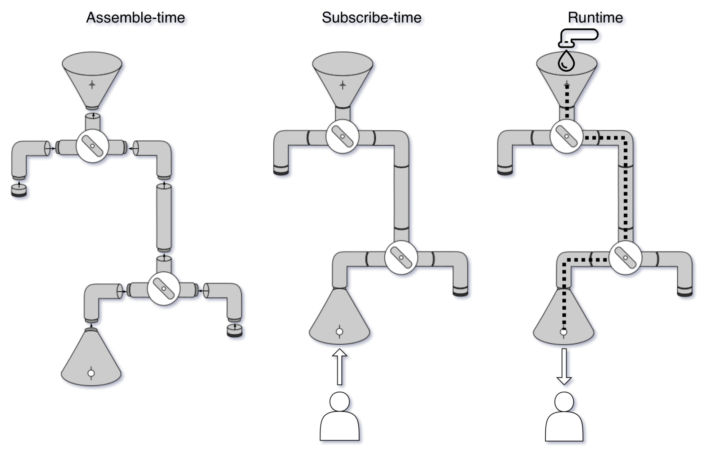

# 生命周期

### 组装时（创建对象）
因为Reactor API 要求不可变性，所以每一个操作符都会生成一个新的对象。构建整个执行流程叫组装（执行时会优化）。

```java
FluxFilter(
        FluxMap(
                FluxArray(1,2,3,4)
        )
        )
```
等价于
```java
Flux<Integer> sourceFlux = new FluxArray(1,2,3,4);
Flux<String> mapFlux = new FluxMap(sourceFlux,String::valueof);
Flux<String> fluxFilter = new FluxFilter(mapFlux,s -> s.length() > 1)
```

### 订阅时（创建订阅Array）

为了构建流程，我们对Publishers进行互相传递。一旦订阅了顶层包装器，我们就开启了整个订阅链的订阅过程。

```java
filterFlux.subscribe(Subscriber) {
    mapFlux.subscribe(new FilterSubscriber(Subscriber)) {
        arrayFlux.subscribe(new MapSubscriber(FilterSubscriber(Subscriber))) {
            //这里是推送的元素
        }}}
```
亦是对我们组装完成的Flux内部所有的Publisher执行subscribe方法
```java
ArraySubscriber(MapSubscriber(FilterSubscriber(Subscriber)));
```
Flux内部维持一个FluxArray（包装器的反向金字塔），Subscribers金字塔顶部有ArraySubscriber包装器（执行时会优化）。

### 运行时

Publisher和Subscriber开始信号交换，首先交换onSubscribe和request信号。onSubscriber位于顶端（最后一个publisher），它会将它的Subscription传递给指定Subscriber。

一旦Subscription完整通过Subscriber，每一个Subscriber会包装Subscription，得到Subscription金字塔：

```java
FilterSubscription {
    MapSubscription {
        ArraySubscription()}}
```
Subscription链完成时，最后一个Subscriber接受Subscription链，开始启动request方法。完成所有request方法后开始发送元素。

运行时，我们应该进行优化，减少信号交换量（request方法会对复杂保存需求volatile字段进行写入，最好避免）。

